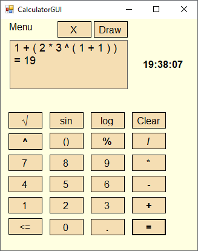
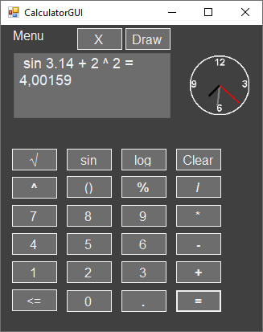

# Simple-Calculator-GUI
## General Info
The project is an advanced graphing calculator with customizable graphic interface and possibility to create graph of functions. It's my re-build university project.

## Screenshots

 Calculator: 

 

 Calculator changed style: 

 

 Function graph: 

 

## Technologies used
* C# - Main language.
* Windows Forms - Free, open-source framework for creating graphical applications(GUI).
* OxyPlot - Cross-platform plotting library used to draw function graphs.

## Features
* Computing basic operations (+, -, /, *, %) with the use of brackets.
* More advanced operations like raising to a power, square-root, logarithms. 
* Customizable interface (GUI style, build-in clock style)
* Creating function graphs (except complex function e.g. log x^2)

To do:
* Implement complex function graphs

## Setup
Use the NuGet package manager to add the OxyPlot package, then just build and run project solution in Visual Studio.
